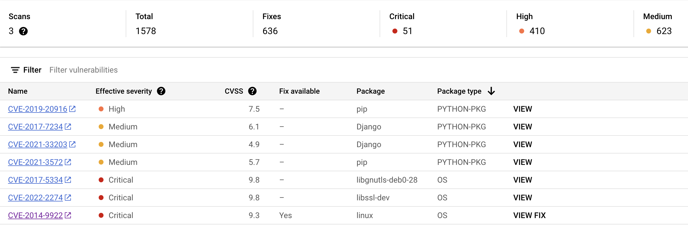
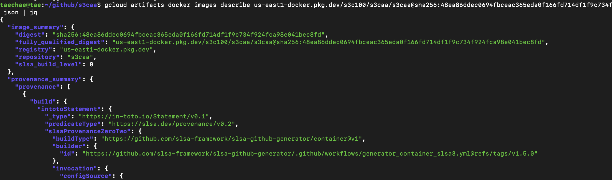
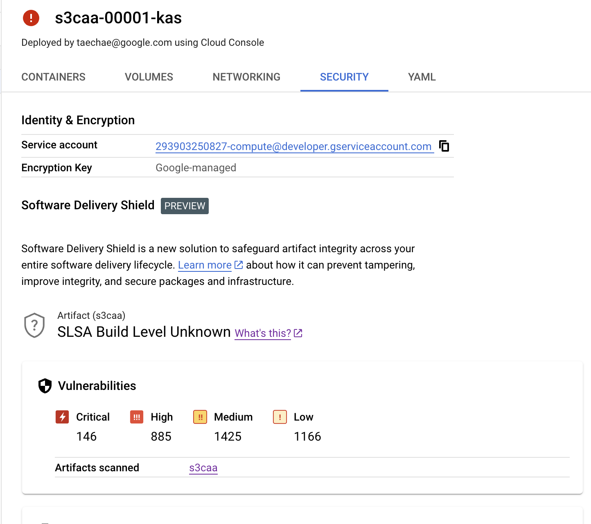

# aactl

Google [Container Analysis (AA)](https://cloud.google.com/container-analysis/docs/container-analysis) service data import utility, supports OSS vulnerability scanner reports, SLSA provenance, and sigstore attestations.

> Installation instruction with support for Go, Homebrew, RHEL/CentOS, Debian/Ubuntu, and Binary are available [here](INSTALLATION.md).

## Usage 

`aactl` supports imports of two data types: `vulnerability` and `attestation`.

> In addition to CLI, `aactl` can also be used in your CI/CD pipeline as a Google Cloud Build builder ([example](examples/cloud-build/README.md)) or GitHub Actions action ([examples](examples/github-actions/README.md)).

### Vulnerability 

To import vulnerabilities output by either [grype](https://github.com/anchore/grype), [snyk](https://github.com/snyk/cli), [trivy](https://github.com/aquasecurity/trivy) scanners, start by exporting the report in JSON format: 

* [grype](https://github.com/anchore/grype)

  `grype --add-cpes-if-none -s AllLayers -o json --file report.json $image`

* [snyk](https://github.com/snyk/cli)

  `snyk container test --app-vulns --json-file-output=report.json $image`

* [trivy](https://github.com/aquasecurity/trivy)

  `trivy image --format json --output report.json $image`

Once you have the vulnerability file, importing that file into AA using `aactl`:

```shell
aactl vulnerability --project $project \
                    --source $image \
                    --file report.json \
                    --format trivy
```

> The $image variable in the above example is the fully qualified URI of the image including its digest (e.g. `us-docker.pkg.dev/project/repo/image@sha256:397d453...`).

To review the imported vulnerabilities in GCP:

```shell
gcloud artifacts docker images list $repo \
  --show-occurrences \
  --format json \
  --occurrence-filter "kind=\"VULNERABILITY\" AND resource_url=\"https://$image\""
```

You can also navigate to Artifact Registry to view the vulnerabilities there. 



### Attestation

In addition to vulnerabilities, `aactl` can also import [sigstore](https://github.com/sigstore) attestations:

```shell
aactl attestation --project $project --source $image
```

> The $image variable in the above example is the fully qualified URI of the image including its digest (e.g. `us-docker.pkg.dev/project/repo/image@sha256:397d453...`).

The imported data can be accessed using `gcloud`:

```shell
gcloud artifacts docker images describe $image --show-provenance --format json
```

The resulting JSON will look something like this: 



The data along with the SLSA level can also be viewed in Software Delivery Shield side panel:



## Contributing

Entirely new samples are not accepted. Bug fixes are welcome, either as pull
requests or as GitHub issues.

See [CONTRIBUTING.md](CONTRIBUTING.md) for details on how to contribute.

## Licensing

Code in this repository is licensed under the Apache 2.0. See [LICENSE](LICENSE).
